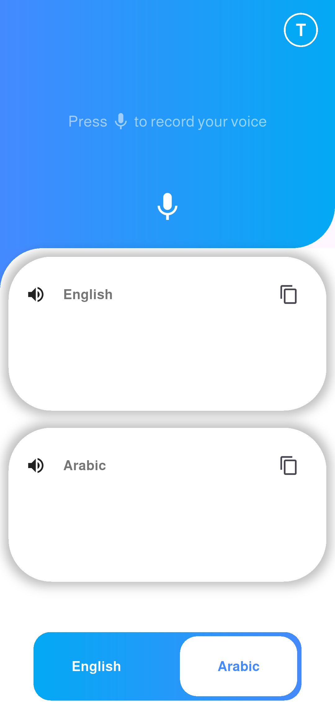

# Speech-Text-Assist

This Flutter application helps individuals who are deaf or hard of hearing by converting spoken language into written text in real-time. The app uses speech recognition to display transcribed speech on the screen, enabling easier communication.

## 🚀 Features
- Real-time speech recognition
- Clean and simple UI for quick readability
- Designed for accessibility

## 🛠️ Technologies Used
- Flutter
- Google Speech-to-Text API

## 🎯 Objective
To bridge the communication gap for the hearing-impaired community and promote more inclusive communication.

## 📱 Screenshots
### Home Screen

## 🧑‍💻 Author
Mohamed Mohamed Barakat
