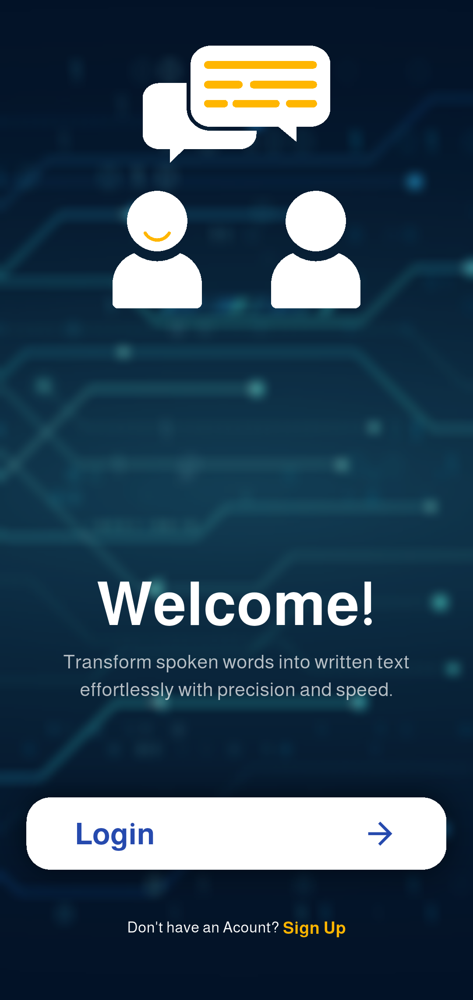
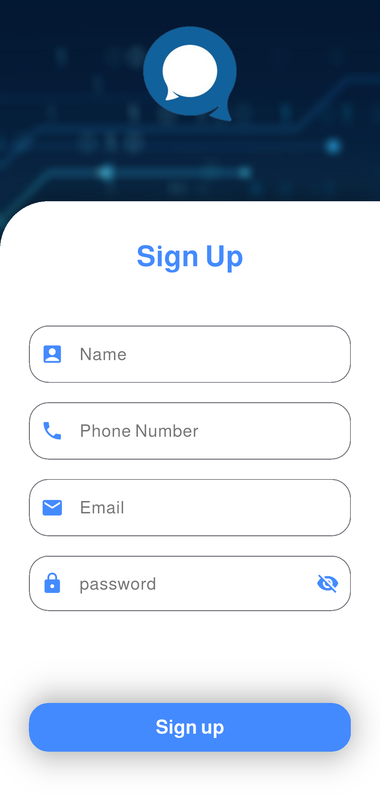
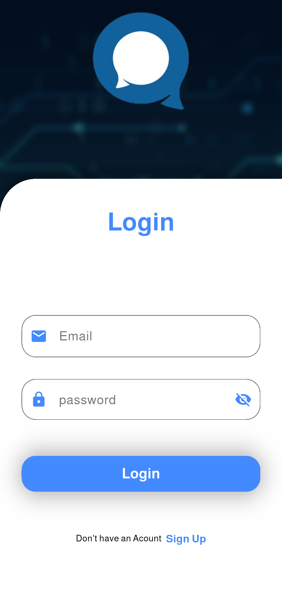
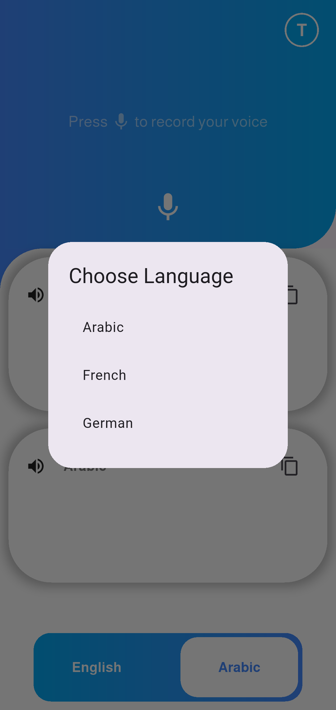

# 📱 Speech-Text-Assist

**Speech-Text-Assist** is a Flutter application that helps individuals who are deaf or hard of hearing by converting spoken language into written text in real-time. The app uses speech recognition to display transcribed speech on the screen, enabling easier communication.

---

## 🚀 Features
- Real-time speech recognition
- Clean and simple UI for quick readability
- Designed for accessibility

---

## 🛠️ Technologies Used
- Flutter
- Google Speech-to-Text API

---

## 🎯 Objective
To bridge the communication gap for the hearing-impaired community and promote more inclusive communication.

---

## 📱 Screenshots

### Welcome Screen

  

### Sign up Screen

  

### Login Screen

  

### Home Screen

  

### Home Screen (Change Language)

  

---

## 🧑‍💻 Author
**Mohamed Mohamed Barakat**
